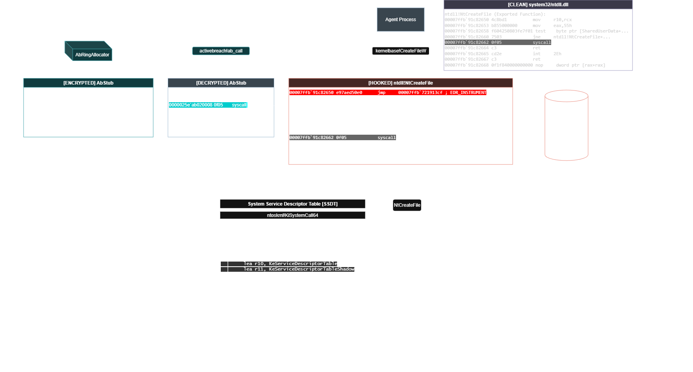

# ACTIVEBREACH-ENGINE (ABE)

**ActiveBreach-Engine** now has a article detailing it's internals [here](https://titansoftwork.com/blog/activebreach/)

**ActiveBreach-Engine (ABE)** is a Windows execution capability platform designed to support authorized adversary emulation, detection validation, and low-level security research in modern EDR-protected environments.

**ABE** provides a controlled, fully dynamic mechanism for executing Windows system calls without reliance on user-mode API invocation or resident `ntdll.dll` code paths, enabling security teams to evaluate detection coverage, telemetry fidelity, and behavioral assumptions made by modern EDR, XDR, and security monitoring solutions.

This project is architected as a successor-class capability to historical syscall research tooling (e.g., SysWhispers and Hell’s Gate), addressing the limitations, static assumptions, and detectability issues inherent in earlier designs.

## SCOPE

Modern defensive products increasingly rely on user-mode instrumentation due to Microsoft locking down the kernel. This instrumentation comes in many forms, such as *API hooking* and *behavioral inference*, to detect malicious activity. While effective, these approaches introduce blind spots at the user-to-kernel boundary.

**ABE** targets what defensive products cannot control: the system itself. A common approach is for products to set *API hooks* on `Nt*` functions, which are exported by `ntdll.dll` and contain the `syscall` instruction. The `syscall` instruction is important for two reasons:

1. It is not instrumentable by user-mode products  
2. It performs a context switch  

When the CPU executes the `syscall` instruction, it transitions execution into a privileged kernel-mode context. This context switch itself is not directly observable by user-mode defensive products. API hooking, by contrast, relies on redirecting execution prior to the syscall, which executes the defensive product’s instrumentation routine. From an adversary emulation perspective, executing that instrumentation is undesirable.

This is where **ABE** comes in. **ABE** builds an in-process ring of syscall stubs, encrypts them, and sets up a specialized dispatcher to decrypt and execute these syscalls. All execution is managed by ABE’s context-controlled dispatcher thread. This results in a controlled execution environment where system calls can be dispatched without user-mode monitoring or external product interference.

For a full technical outline, see [Technical Overview](./TECH.md)

## DEVELOPMENT

For ease of integration, **ABE** is provided in three trims: C, C++, and Rust. Rust is the most technically advanced implementation, while C++ offers an integrated debugger.

### Why three versions?

Primarily due to integration complexity. Linking cryptographic libraries and using Windows internal structures in C++ introduces development friction and unnecessary complexity. The goal of **ABE** is ease of integration, which means no external dependencies. As a result, the C and C++ versions are provided as single-include header files (`.h`).

The Rust version includes exclusive features such as build-time encrypted stub templates, a custom stub ring allocator, and TLS callbacks.

## RUST INTEGRATION & FFI

The Rust SDK is modular and portable:

- Native Rust integration (path dependency or crate dependency)
- C ABI integration via `activebreach.dll` (runtime loading or import-lib linking)
- Static linking via `activebreach.lib`

This C ABI surface is intentionally language-agnostic and can be consumed from C/C++, C#, Zig, Nim, Odin, D, Python (`ctypes`/`cffi`), and similar FFI-capable runtimes.

Build outputs from `SDK/Rust/target/{debug,release}` include:
- `libactivebreach.rlib` (Rust-to-Rust)
- `activebreach.dll` (shared library, C ABI)
- `activebreach.dll.lib` (MSVC import library for the DLL)
- `activebreach.lib` (static library)

C ABI header:
- `SDK/Rust/include/activebreach.h`

Exported symbols:
- `activebreach_launch`
- `ab_call`
- `ab_violation_count`
- `ab_set_violation_handler`
- `ab_clear_violation_handler`

Integration models on Windows:
1. DLL only (runtime dynamic loading with `LoadLibrary`/`GetProcAddress`)
2. DLL + import LIB (implicit link with `activebreach.dll.lib`)
3. Static LIB (`activebreach.lib`, no runtime DLL dependency for this library)

## USAGE

See [Usage Overview](./USAGE.md)

## RUST FEATURE MODES

The Rust SDK ships with the following feature flags:

- `secure` (default): Stub pages are protected at rest with `PAGE_NOACCESS` and protections are flipped during acquire/patch/execute/release. This reduces cleartext stub exposure in memory at the cost of more `VirtualProtect` transitions. This is intended for operators who want to maximize in-process security and want absolute certainty that their syscalls will not be tampered with.
- `stealth`: Marker feature for "no `secure`". To actually run without protection flips, build with `--no-default-features` (and optionally add `--features stealth` to make the intent explicit). In this mode stub pages remain writable/executable, reducing flip noise but leaving stubs more exposed in memory. This is intended for operators who want to minimize page-flipping visibility
- `long_sleep`: Enables an idle teardown path in the dispatcher. After a configurable idle interval (default 30_000ms), the dispatcher drops the stub pool and syscall table, then blocks until new work arrives. The public API `ab_set_long_sleep_idle_ms(ms)` is only available with this feature. This is intended for operators developing **long-living** or **LOTL** processes who want to avoid memory-scanners.
- `ntdll_backend`: Prefer jumping into an intact loaded-`ntdll.dll` syscall prologue (inside `ntdll` `.text`) instead of issuing `syscall` from the ActiveBreach stub. If the loaded export stub/prologue is detected as hooked or invalid, the dispatcher falls back to the direct-syscall stub. Stack spoofing is disabled in this backend (no synthetic return chain is constructed). This is intended for operators who want minimal EDR foresnsics and are operating in a heavily instrumented environment.

Example builds:

- Default (recommended baseline):
  - `cargo build`
- Stealth-ish (no `secure` protection flips):
  - `cargo build --no-default-features --features stealth`
- Long-idle friendly:
  - `cargo build --features long_sleep`
- Prefer loaded-NTDLL prologues when intact:
  - `cargo build --features ntdll_backend`

## Disclaimer

This tool is provided for **educational and authorized security research only**.  
Unauthorized use may violate applicable laws. The authors and contributors assume no liability.

## License

Copyright © 2026 TITAN Softwork Solutions

Licensed under the Apache License, Version 2.0 (the "License") **with the Commons Clause License Condition v1.0**.

- You may not use this software for commercial purposes ("Sell the Software" as defined in the Commons Clause).
- Full text is provided in `LICENSE`.

Apache 2.0: <http://www.apache.org/licenses/LICENSE-2.0>  
Commons Clause details: <https://commonsclause.com/>
